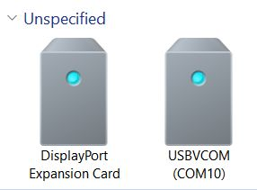
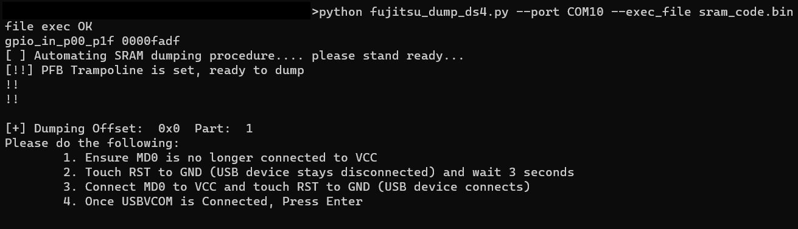

# Dumping DS4 in Windows

---

Required Files List:

1. `fujitsu_dump_ds4.py`

2. `sram_code.bin`

3. `Infineon-FLASH_USB_DIRECT_Programmer-DevelopmentTools-v01_00-EN (1).zip`

## Install USB Drivers

Install the drivers located in the `Infineon-FLASH_USB_DIRECT_Programmer-DevelopmentTools-v01_00-EN.zip` file. Alternatively, you can download this from the Infineon website directly.

## Solder Jumpers

Ensure you have jumper wires soldered to MD0, VCC, GND (capacitor was used in this write-up), and RST. You can verify these are the correct points by plugging in the Dualshock controller, holding MD0 and VCC together, and pressing RST to GND. The device will reconnect to the USBVCOM and give you a COM number.

## Connect to Serial Write (USBVCOM) Mode

Connect the Dualshock 4 controller while holding MD0 to VCC and touching RST to GND. Once the device has been booted into USBVCOM, you no longer need to hold MD0 to VCC.

You should see this device appear. If Windows cannot find the device drivers, make sure you've installed the Infineon Flash-USB Direct programmer.

## Run fujitsu_dump_ds4.py

Run the dump file with the following commands:

`python fujitsu_dump_ds4.py --port COM06 --exec_file sram_code.bin`

Change your port to the corresponding COM number and ensure that you have sram_code.bin in the folder. You should see the following screen:

Follow the instructions on the tool, ensuring that you let the USB disconnect and reconnect with MD0 held after each step.

Once you've dumped all 9 parts, the script will automatically combine the parts into dump.bin as seen here.

Done! Run your dump.bin through `jedi_crypto-3Files.py` or any other conversion tool to load into a game controller project.