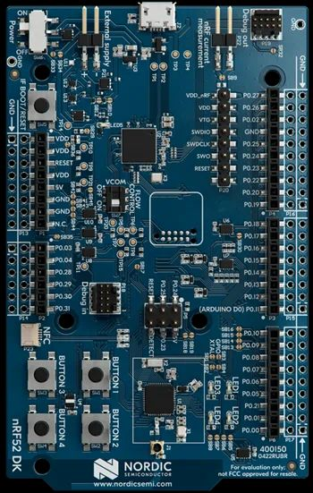

# PS4 : Completing the Dualshock4 FW Dumping in 2023

__by anonymous_ps4__

---

## DS4 Background

It's been several years since the DS4 FW was dumped. Now that multiple gaming controller projects support Playstation 4 using the DS4 leaked keys, I wanted to be able to dump my own DS4 keys for private use in 2023. This is both a technical blog on how I did it, as well as issues I ran into along the way.

These keys are considered intellectual property to their owner, and projects have been DMCA'd for posting dumps. No dumps will be posted here, and dumping FW can get you slapped with some pretty hefty C&Ds. These firmware files contain a randomly generated RSA private key, a serial key for the DS4 controller, a public signature of the serial key + public modulus values of the RSA public key hashed by the controller manufacturer's private key. These three values allow gaming controller projects (and not-so-legit sellers) to work on a Playstation 4 without the authentication time-out.

If you do not have any background in RSA key encryption, have a look at [Microsoft's Encryption and Decryption Blog](https://learn.microsoft.com/en-us/dotnet/standard/security/generating-keys-for-encryption-and-decryption) for more technical details.

## Finding the Pins on a Non JDM-001

The first step of my journey was taking apart the DS4 controllers I owned and hoping one of them contained the JDM-001 board used in the fail0verflow explanation from 2018. This board has a nice MD0 pin clearly marked, and big solder points to create jumpers with. Unfortunately, my controllers were a JDM-011 and a JDM-030. The JDM-030 seemed to have a lot less open pins, but the JDM-011 looked promising.

Looking at the front and back of the JDM-011 PCB, I can see that there are several solder points that match the JDM-001 PCB but do not have the same labels. Specifically, the MD0 point has a pull-up resistor (MD1 is not connected), the GND comes from a nearby capacitor, the RST point is clearly marked, and the VCC will come from the same pin on the JDM-001. Some traces are slightly different on this revision, but it is much easier to trace than the JDM-030.


Assuming these points are correct, I then soldered up some small gauge wires to each point and left them long enough to touch together. I also used a little protective tape incase the VCC made contact on the board and shorted something out. Now in theory, I should be able to hold the MD0 wire to the VCC wire and touch together the RST pin to GND while the controller is plugged in. Here is a quick highlight of what that looks like.


With the DS4 plugged into my PC as a Wireless Controller, I held the MD0 wire to the VCC wire, and touched RST to GND. The controller restarted into a new VID/PID, and I knew I had the right pins! The driver does not come with Windows, so I had to download the [FLASH USB DIRECT Programmer]( https://www.infineon.com/cms/en/product/gated-document/flash-usb-direct-programmer-8ac78c8c7d0d8da4017d0f88a77973ed/) to get the drivers properly working.


Once I had the drivers installed, I restarted the controller in serial writer mode (MD0 to VCC) and the USBVCOM port became available. Success!! I now had a working JDM-011 PCB with serial writer mode enabled that was ready to dump firmware.

## Getting to SRAM Persistence

Now that I could connect to the board through the COM port, I followed along with the fail0verflow blog and downloaded. the [Fujitsu Serial Programming Mode Replacement](https://github.com/shuffle2/fujitsu_rom_com) project. This project does not supply the SRAM bin file, but I've included it in this repo as *sram_code.bin*.

Launching the Python script with `python fujitsu_rom_com.py --port COM10 --exec_file sram_code.bin`, I now had a working Python shell on the DS4 controller!


Running a simple for loop, I could snapshot a dump of SRAM and attempt the persistence trick.

```
f = open('SRAM.dump', 'wb')
for i in range(0, 1024):
    f.write(c.read(0x40000000 + i*1024, 1024))
f.close()
```

Looking at the dump file, this is definitely ARM data! I could load this in Ghidra and get a few snippets of code as well as some function pointers. Now let's try some persistence!

```
for i in range(0,4096):
    c.write(0x40000000 + i * 256, '\xCC'*256)
```

**> REBOOT USING RST PIN TO GND**

**> DUMP SRAM AGAIN**

**> SEARCH FOR 0xCC PATTERN**`

And we get a hit!


NICE! We have persistence at `0x20038000` all the way to `0x2003FFFF`. That gives us `0x20038000 to 0x2003FFFF` or 32767 bytes to inject a payload and dump chunks of firmware into the persistence area of SRAM.

So, we have the following:

1. A working JDM-011 PCB with MD0 Serial Write mode enabled
2. SRAM reading and writing via Fujitsu ROM COM replacement
3. Persistent SRAM storage for writing an exploit payload of some type and outputting our firmware chunks

Now, the next step is really what was "missing" from all of these blogs and dumps about DS4 do-it-yourself.

## Failing at Flash Patching on ARM Cortex-M3

The fail0verflow blog from 2018 [here](https://fail0verflow.com/blog/2018/ps4-ds4/) describes the process they used to pull DS4 firmware into SRAM. The Flash Patch and Breakpoint Unit (PFB) seemed to have some magic code space fetch actions that remap system space. However, the critical component of "how" you do this was left to the reader, and no other blogs or githubs have actual code or examples of how this was done.


The author of [Passing Link](https://github.com/passinglink/passinglink) also mentions a code injection using the FPB unit, but fails to explain the "how". This seems to be a bit more detailed, but.... what does it mean "FPB unit only works on code fetches"?


I was really flying blind here, as I had never written a flash patch or messed with hardware level breakpoints on an ARM chip. I did not really understand the "usual tricks" comment made by jmgao, but figured I could play around with it and try out a few different payloads until something hit.

Here was the ARM assembly I ended up using for copying memory. This ended up working just fine for my final payload.

```
    mov  r0, 0x0000; // lower part of address
    movt r0, 0x0000; // upper part of address
    mov  r1, 0x8200; // output SRAM:
    movt r1, 0x2003; //  [payload] [padding] 0x20038200
    mov  r4, 0x400;
up: ldr  r3, [r0], #4;
    str  r3, [r1], #4;
    subs r4, r4, #1;
    BNE  up;
```

But now I had to generate an FPB SRAM table. I found a few tutorials and diagrams as well as the ARM documentation, but nothing really made sense. Here was the two diagrams I tried to follow:


It looks like you just simply create a remap table and then code magically appears. But, nothing I did worked. I couldn't just enter the address I wanted to jump to, and I was crashing the firmware every time I restarted into a patch. So, it was time to dig a bit more.

## Analyzing the Flash Patch and Breakpoint (FPB) on an nRF52DK

I was pretty stumped at this point, there was no way to verify my patch worked and I was crashing anytime I'd try applying a flash patch. Then I found this tutorial on breakpoints by Interrupt: [How do breakpoints even work?](https://interrupt.memfault.com/blog/cortex-m-breakpoints). This blog linked to a github that had a lot of really useful functions, including running functions that had been patched by the debugger.

 I remembered I have a [Nordic nRF52 DK](https://www.nordicsemi.com/Products/Development-hardware/nRF52-DK) laying around with an ARM Cortex-M4 chip inside of it. These boards can run a J-Link GDB instance that gives you full control of the running operating system. This means I can setup a Flash Patch then monitor it with GDB to see how the chip reacts to different SRAM patch tables.



This lets us run a GDB server using the J-Link software and connect to it through the ARM GDB Windows application (Arm GNU Toolchain arm-none-eabi 11.3 rel1).


I combined this tutorial with the [Nordic-Playground](https://github.com/NordicPlayground/nRF52-flash-patch/blob/master/example/flash_patch.c) flash patch project example. In this example, the author generates an SRAM flash patch table using the following logic:

```
uint32_t calc_branch_instr(uint32_t instr_addr, uint32_t target_addr)
{
	uint32_t offset = target_addr - instr_addr;
	uint16_t offset_10_upper = (offset >> 12) & 0x03FF;
	uint16_t offset_11_lower = ((offset - 4) >> 1)  & 0x07FF; // UNCERTAIN about this!
	
	uint8_t s_pos = 24;
	uint8_t s  = (offset - 4) & (1 << s_pos);
	uint8_t i1 = (offset - 4) & (1 << (s_pos - 1));
	uint8_t i2 = (offset - 4) & (1 << (s_pos - 2));
	
	uint8_t j1 = 0x01 & ((~i1) ^ s);
	uint8_t j2 = 0x01 & ((~i2) ^ s);
	
	uint16_t upper_bl_instr =  ((0x1E << 11) | (s << 10) | offset_10_upper);
	uint16_t lower_bl_instr =  ((0x02 << 14) | (j1 << 13) | (0x01 << 12) | (j2 << 11) | offset_11_lower);
	
	return ((upper_bl_instr << 16) | lower_bl_instr);
}
```

I can now try to make a flash patch SRAM table using this branch instruction patch, and try it out.


After patching the dummy function 1 with my dummy function 6, it works! I'm able to redirect calls from 1 to 6. So now let's try setting up an SRAM memory copy and redirecting calls.

Hmmm... this isn't working. When I manually inspect the calc_branch_instr(), I notice the distance from my SRAM to the flash patch location is not properly set.

## Defeating the ARM Branch Range

The problem is my lack of deep knowledge in ARM assembly. The Branch instruction has a limit in how far we can travel. The [ARM documentation](https://community.arm.com/arm-community-blogs/b/architectures-and-processors-blog/posts/branch-and-call-sequences-explained) covers this pretty well, so there is no way we can go from 0x00001234 to 0x20038200 with a standard branch instruction.

I think I finally understand jmgao's "usual tricks" at least slightly at this point. After stumbling around, I finally land on Raymond Chen's explanation of [The ARM Process (Thumb-2), part 13: Trampolines](https://devblogs.microsoft.com/oldnewthing/20210616-00/?p=105314) where he outlines the following code:

```
    bl      toofar_trampoline
...

toofar_trampoline:
    mov     r12, #lo(|toofar|+1)
    movt    r12, #hi(|toofar|+1)
    bx      r12             ; jump to r12
```

Now this is looking almost verbatim with jmgao's explanation of how to do a trampoline. So we have to move our exploit/payload location into r12 using two move operations, then bx (branch with code switch) to r12.

The other "A-HA!" moment here is the fact we have 3 assembly operations we need to run in order to properly patch and exploit the ARM Cortex chip. To do this, we need to patch the code 3 times. This was determined by looking at how the calc_branch_instr() worked (1 single 4 byte patch), which we need to replace with 3 instruction sets.

So we now know we have to do the following:

```
FP_CTRL = enable to patch system
FP_REMAP = patch table address consisting of 4-byte instructions
FP_COMP[0] = mov r12, #lo(toofar+1)
FP_COMP[1] = movt r12, #hi(toofar+1)
FP_COMP[2] = bx r12, nop for padding
```


Writing a little test branch in our nRF52 code, we can test this to make sure it works:

```
bool fpb_set_patch(size_t comp_id, uint32_t instr_addr, uint32_t target_addr) {
  sFpbConfig config;
  fpb_get_config(&config);
  if (config.revision != 0) {
    EXAMPLE_LOG("Revision %d Parsing Not Supported", config.revision);
    return false;
  }

  const size_t num_comps = config.num_code_comparators;
  if (comp_id >= num_comps) {
    EXAMPLE_LOG("Instruction Comparator %d Not Implemented", num_comps);
    return false;
  }

  if (instr_addr >= 0x20000000) {
    EXAMPLE_LOG("Address 0x%x is not in code region", instr_addr);
    return false;
  }

  if (!config.enabled) {
    EXAMPLE_LOG("Enabling FPB.");
    fpb_enable();
  }

  FPB->FP_COMP[comp_id] = (instr_addr | 0x01UL);

trampoline = bytes([0x48,0xf2,0xff,0x0c,
                    0xc2,0xf2,0x03,0x0c,
                    0x60,0x47,0x09,0x46])

  // set 4 patches
  // [nop][mov r2,lower][mov.t r2,higher][nop][bx r2]
  uint8_t bytes[] = {0x09,0x46,0x09,0x46,0x4f,0xf4,0x41,0x4c,0xc2,0xf2,0x00,0x0c,0x09,0x46,0x60,0x47};
  memcpy(((uint32_t *) (remap_table_addr)), bytes, sizeof(bytes));

  // lets drop a shellcode and make sure this works
  uint8_t shell[] = {
    0x4f,0xf0,0x00,0x00,0xc0,0xf2,0x00,0x00,
    0x4f,0xf4,0x42,0x41,0xc2,0xf2,0x00,0x01,
    0x4f,0xf4,0x80,0x74,0x50,0xf8,0x04,0x3b,
    0x41,0xf8,0x04,0x3b,0x01,0x3c,0xf9,0xd1
  };

  memcpy(((uint32_t *) (shell_addr)), shell, sizeof(shell));

  return true;
}
```

Now we can run fpb_set_patch and patch our function call to verify this works on the nRF52DK. It works! As long as we do our patching in multiple steps and set the patch tables accordingly, we can run up to 8 full 4-byte patches and execute any code we want. This means we have flash patching working by setting 3 different "breakpoints" with patch locations, and the final instruction patch will branch to our SRAM allowing code execution. Our payload now looks like this:

```
Set our Flash Patch registers:

FP_REMAP_ADDRESS
    0x20038200
FP_COMP[0] Enabled 1, Replace: 0, Function to Overwrite Address
FP_COMP[1] Enabled 1, Replace: 0, Function to Overwrite Address + 4
FP_COMP[2] Enabled 1, Replace: 0, Function to Overwrite Address + 8
```

```
Copy our payload to the remap address "table" which is 4-byte instructions

0x20038200: mov     r12, #lo(|0x20038200|+1)  ; FP_COMP[0]
0x20038204: movt    r12, #hi(|0x20038200|+1)  ; FP_COMP[1]
0x20038008: bx      r12                       ; FP_COMP[2]
0x2003800A: mov     r1,r1  ;  NOP for padding
```

Now we just need to line this up to the DS4 SRAM dump and we should have running code in SRAM using the FPB.

## Moment of Truth: Flash Patching on the DS4

In jmgao's blog, he mentions using `0x00000000` as the patch address, but I found this crashes when I rebooted into serial mode. Instead, I looked up some information about the known FW to see if there were any addresses I could piggy-back off that would land in controller mode and skip in serial mode. I found a nice landing spot at `0x8214` that would lock the wireless controller in USB mode and work on serial writer in USB mode. There are many spots that would work, but this seemed to do the trick for what I needed. Fail0verflow mentioned looking at the stack returns, but this saved me a lot of time guessing on return values.

I wrote the following Python code to help generate a set of commands for the Fujitsu python script. The assembly code was generated by compiling the ASM manually and dumping the GDB bytes, but this could be much cleaner. The Python script included in this repo contains a much more helpful dumping script.

```
# Trampoline to 0x20038100
#  mov     r12, 0x80FF;  PATCH[0] 4 bytes
#  movt    r12, 0x2003;  PATCH[1] 4 bytes
#  bx      r12;          PATCH[2] 2 bytes ..
#  mov     r1,r1;        NOP (4 byte aligns our table) 2 bytes ..
trampoline = bytes([0x48,0xf2,0xff,0x0c,
                    0xc2,0xf2,0x03,0x0c,
                    0x60,0x47,0x09,0x46])

#	"mov  r0, 0x0000;"  Change Offset Here
#	"movt r0, 0x0000;"
#	"mov  r1, 0x8200;"  0x20038200 Dump SRAM
#	"movt r1, 0x2003;"
#	"mov  r4, 0x7F00;"  Copy 0x7F00 bytes
#  "up: ldr  r3, [r0],#4;"
#	"str  r3, [r1],#4;"
#	"subs r4, r4,#1;"
#	"BNE  up;"
copyFlash = bytes([0x4f, 0xf0, 0x00, 0x00, 0xc0, 0xf2, 0x00, 0x00,
                    0x4f, 0xf4, 0x02, 0x41, 0xc2, 0xf2, 0x03, 0x01,
                    0x4f, 0xf4, 0xfe, 0x44, 0x50, 0xf8, 0x04, 0x3b,
                    0x41, 0xf8, 0x04, 0x3b, 0x01, 0x3c, 0xf9, 0xd1])

print("c.write32(0xE0002000,0x03)")       # enable FPB
print("c.write32(0xE0002004,0x20038000)") # remap table
print("c.write32(0xE0002008,0x8214|1)")   # address | enable
print("c.write32(0xE000200C,0x8218|1)")   # address + 0x4 | enable
print("c.write32(0xE0002010,0x821C|1)")   # address + 0x8 | enable
print("c.write(0x20038000, bytes.fromhex('"+trampoline.hex()+"'))")
print("c.write(0x20038100, bytes.fromhex('"+copyFlash.hex()+"'))")
print("c.write(0x20038200, ('A'*256).encode('utf-8'))")  # watch the canary

```

I also manually generated a canary (repeating 'A') to make sure my memory copy worked. I could then do a `c.read(0x20038200, 256)` and check for A's. Running this code resulted in the first `0x7F00` bytes of the firmware! It works!!!!!


Now, all that was left was changing the memory copy location in the copyFlash payload to grab the rest of the firmware and dump it all into a file. This is a manual processto reset the controller into standard mode, then back to serial mode between each read. Ultimately this results in 9 parts at `0x7F00` size reads a piece. Combining those together into a single file, and we have a full dump from our own DS4!

Running this through _jedi_crypto-3Files.py_, we get our private key, serial, and signature binary file! We have successfully backed up our own Dualshock 4 controller for private use!

As an added bonus, I automated this whole process in `fujitsu_dump_ds4.py` which you can find in the `Dumping` folder of this repo.
